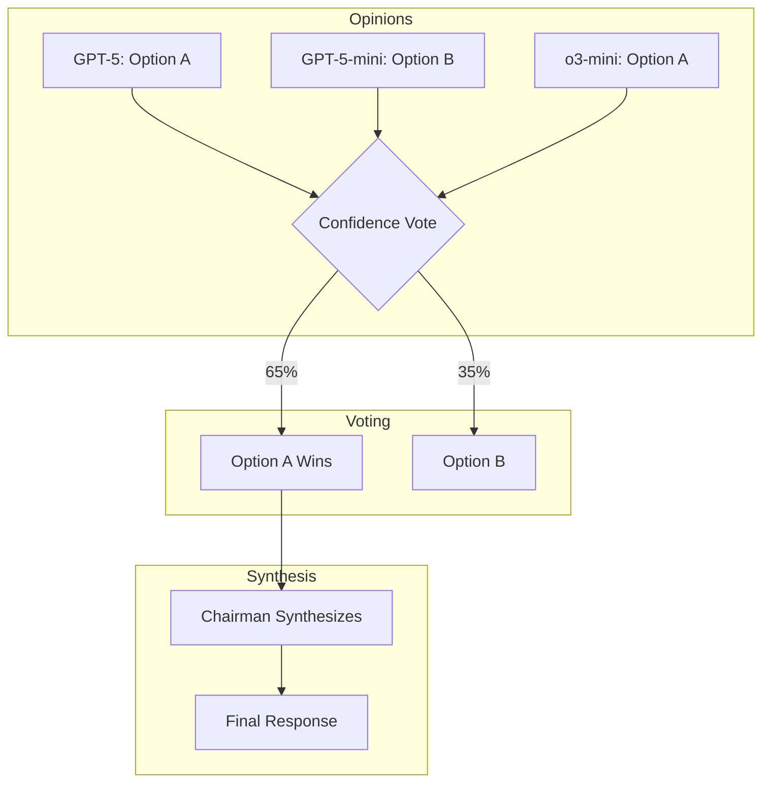
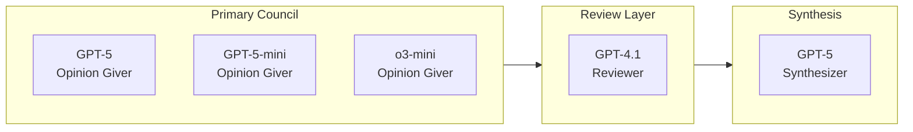
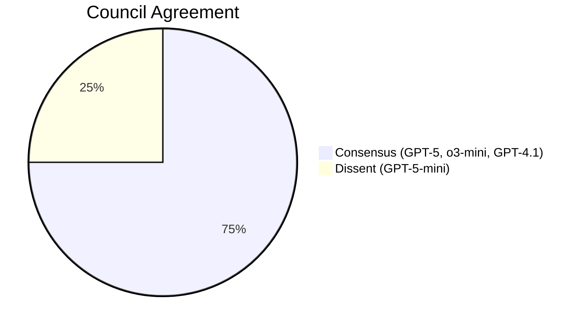

# Visual Output Formats

> **Purpose:** Guide to visual output and export formats for council sessions  
> **Last Updated:** January 10, 2026

---

## Table of Contents
- [1. Export Formats](#1-export-formats)
- [2. Markdown Output](#2-markdown-output)
- [3. Mermaid Diagrams](#3-mermaid-diagrams)
- [4. HTML Reports](#4-html-reports)
- [5. Timeline Visualization](#5-timeline-visualization)
- [6. Voting Visualizations](#6-voting-visualizations)
- [7. Implementation Guide](#7-implementation-guide)

---

## 1. Export Formats

The LLM Council supports multiple export formats:

| Format | Extension | Use Case |
|--------|-----------|----------|
| JSON | `.json` | Full data export, reimport |
| YAML | `.yaml` | Human-readable config |
| Markdown | `.md` | Documentation, sharing |
| HTML | `.html` | Standalone reports |

### Current Type Definition
```typescript
// packages/core/src/types.ts
export type ExportFormat = 'json' | 'yaml' | 'markdown' | 'html';

export interface ExportOptions {
  format: ExportFormat;
  includeTraces?: boolean;
  includeVoting?: boolean;
  includeTimings?: boolean;
  prettyPrint?: boolean;
}
```

---

## 2. Markdown Output

### Session Summary Format

```markdown
# Council Session: {question_preview}

**Session ID:** `{session_id}`  
**Date:** {timestamp}  
**Preset:** {preset_name}  
**Duration:** {duration_ms}ms  
**Total Tokens:** {total_tokens}  

---

## Question

{full_question}

---

## Council Response

{synthesized_response}

**Confidence:** {confidence}%  
**Voting Method:** {voting_method}  
**Agreement:** {agreement_percentage}%  

---

## Council Members

| Member | Model | Role | Confidence |
|--------|-------|------|------------|
| {name} | {model} | {role} | {confidence}% |
...

---

## Individual Opinions

### {member_name} ({model})

> {opinion_text}

**Confidence:** {confidence}%  
**Tokens:** {tokens}  
**Latency:** {latency}ms  

---

## Voting Results

{voting_breakdown}

---

## Timeline

{mermaid_timeline}

---

*Generated by LLM Council v{version}*
```

### Markdown with Rendered Response

For responses containing structured content:

```markdown
## Council Response

The council recommends the following approach:

### Key Points

1. **First recommendation** - Explanation
2. **Second recommendation** - Explanation
3. **Third recommendation** - Explanation

### Code Example

```python
def example():
    return "Council-approved code"
```

### Summary

Final summary of the consensus.
```

---

## 3. Mermaid Diagrams

### Timeline Diagram

```mermaid
gantt
    title Council Session Timeline
    dateFormat  X
    axisFormat %Lms
    
    section Query
    User Question        :a1, 0, 100
    
    section Opinions
    GPT-5               :a2, 100, 450
    GPT-5 Mini          :a3, 100, 320
    o3-mini             :a4, 100, 580
    
    section Review
    Cross-Evaluation    :a5, 580, 200
    
    section Voting
    Confidence Voting   :a6, 780, 100
    
    section Synthesis
    Chairman Response   :a7, 880, 500
```



### Voting Flow Diagram



### Council Composition Diagram



### Agreement Visualization



---

## 4. HTML Reports

### Standalone HTML Report Structure

```html
<!DOCTYPE html>
<html>
<head>
    <title>Council Session Report</title>
    <style>
        /* Embedded styles for portability */
        .council-report { font-family: system-ui, sans-serif; }
        .timeline { /* D3.js timeline styles */ }
        .voting-chart { /* Chart.js styles */ }
        .member-card { border: 1px solid #ddd; padding: 1rem; }
        .confidence-bar { background: #4ade80; height: 8px; }
    </style>
</head>
<body>
    <div class="council-report">
        <header>
            <h1>Council Session Report</h1>
            <p class="meta">Session ID: {id} | {date}</p>
        </header>
        
        <section class="question">
            <h2>Question</h2>
            <blockquote>{question}</blockquote>
        </section>
        
        <section class="response">
            <h2>Council Response</h2>
            <div class="response-content">{response}</div>
            <div class="confidence-meter">
                <div class="confidence-bar" style="width: {confidence}%"></div>
                <span>{confidence}% Confidence</span>
            </div>
        </section>
        
        <section class="members">
            <h2>Council Members</h2>
            <div class="member-grid">
                <!-- Member cards -->
            </div>
        </section>
        
        <section class="timeline">
            <h2>Session Timeline</h2>
            <div id="timeline-chart"></div>
        </section>
        
        <section class="voting">
            <h2>Voting Results</h2>
            <div id="voting-chart"></div>
        </section>
    </div>
    
    <script>
        // Embedded chart rendering
        const timelineData = {timeline_json};
        const votingData = {voting_json};
        // Render charts...
    </script>
</body>
</html>
```

### Interactive Features

- **Collapsible sections** - Expand/collapse individual opinions
- **Hover tooltips** - Show token counts and timing details
- **Copy buttons** - Copy response or code blocks
- **Print-friendly** - CSS media queries for printing

---

## 5. Timeline Visualization

### ASCII Timeline (for terminal/markdown)

```
Session Timeline (1430ms total)
━━━━━━━━━━━━━━━━━━━━━━━━━━━━━━━━━━━━━━━━━━━━━━━━━━━━━━━━━━━━━━━━━━━━━━━

Query     ████░░░░░░░░░░░░░░░░░░░░░░░░░░░░░░░░░░░░░░░░░░░░░░░░░░░ 0-50ms
GPT-5     ░░░░████████████████░░░░░░░░░░░░░░░░░░░░░░░░░░░░░░░░░░░ 50-450ms
GPT-mini  ░░░░████████████░░░░░░░░░░░░░░░░░░░░░░░░░░░░░░░░░░░░░░░ 50-320ms
o3-mini   ░░░░██████████████████████░░░░░░░░░░░░░░░░░░░░░░░░░░░░░ 50-580ms
Review    ░░░░░░░░░░░░░░░░░░░░░░░░░░████████░░░░░░░░░░░░░░░░░░░░░ 580-780ms
Voting    ░░░░░░░░░░░░░░░░░░░░░░░░░░░░░░░░░░████░░░░░░░░░░░░░░░░░ 780-880ms
Synthesis ░░░░░░░░░░░░░░░░░░░░░░░░░░░░░░░░░░░░░░██████████████████ 880-1430ms

━━━━━━━━━━━━━━━━━━━━━━━━━━━━━━━━━━━━━━━━━━━━━━━━━━━━━━━━━━━━━━━━━━━━━━━
```

### JSON Timeline Data

```json
{
  "sessionId": "abc123",
  "totalDuration": 1430,
  "stages": [
    {
      "name": "query",
      "start": 0,
      "end": 50,
      "status": "completed"
    },
    {
      "name": "opinions",
      "start": 50,
      "end": 580,
      "status": "completed",
      "parallel": [
        { "member": "GPT-5", "start": 50, "end": 450, "tokens": 434 },
        { "member": "GPT-5-mini", "start": 50, "end": 320, "tokens": 289 },
        { "member": "o3-mini", "start": 50, "end": 580, "tokens": 521 }
      ]
    },
    {
      "name": "review",
      "start": 580,
      "end": 780,
      "status": "completed"
    },
    {
      "name": "voting",
      "start": 780,
      "end": 880,
      "status": "completed"
    },
    {
      "name": "synthesis",
      "start": 880,
      "end": 1430,
      "status": "completed"
    }
  ]
}
```

---

## 6. Voting Visualizations

### Confidence Bar Chart

```
Voting Results (Confidence Method)
━━━━━━━━━━━━━━━━━━━━━━━━━━━━━━━━━━━━━━━━━━━━━━━━━━━━━━━━━━

Option A (Horizontal Scaling)
████████████████████████████████████████░░░░░░░░░░ 65% ✓

Option B (Vertical Scaling)
██████████████████████████████░░░░░░░░░░░░░░░░░░░░ 35%

━━━━━━━━━━━━━━━━━━━━━━━━━━━━━━━━━━━━━━━━━━━━━━━━━━━━━━━━━━

Individual Votes:
  GPT-5:      Option A (87% confidence) ✓
  GPT-5-mini: Option B (72% confidence) ✗
  o3-mini:    Option A (91% confidence) ✓

Winner: Option A | Consensus: Strong (65%)
```

### Ranked Choice Visualization

```
Ranked Choice Voting
━━━━━━━━━━━━━━━━━━━━━━━━━━━━━━━━━━━━━━━━━━━━━━━━━━━━━━━━━━

Round 1:
  Option A ████████████████████░░░░░░░░░░ 45%
  Option B ████████████████░░░░░░░░░░░░░░ 35%
  Option C ████████░░░░░░░░░░░░░░░░░░░░░░ 20% ❌ Eliminated

Round 2 (Final):
  Option A █████████████████████████████░ 65% ✓ Winner
  Option B ████████████████████░░░░░░░░░░ 35%

━━━━━━━━━━━━━━━━━━━━━━━━━━━━━━━━━━━━━━━━━━━━━━━━━━━━━━━━━━
```

### JSON Voting Data

```json
{
  "method": "confidence",
  "options": [
    {
      "id": "option-a",
      "label": "Horizontal Scaling",
      "score": 0.65,
      "votes": [
        { "member": "GPT-5", "confidence": 0.87, "reasoning": "..." },
        { "member": "o3-mini", "confidence": 0.91, "reasoning": "..." }
      ]
    },
    {
      "id": "option-b",
      "label": "Vertical Scaling",
      "score": 0.35,
      "votes": [
        { "member": "GPT-5-mini", "confidence": 0.72, "reasoning": "..." }
      ]
    }
  ],
  "winner": "option-a",
  "consensus": "strong",
  "dissenting": ["GPT-5-mini"]
}
```

---

## 7. Implementation Guide

### Adding Markdown Export

```typescript
// packages/core/src/export/markdown.ts
export function toMarkdown(session: CouncilSession): string {
  const md = [];
  
  md.push(`# Council Session: ${truncate(session.question, 50)}`);
  md.push('');
  md.push(`**Session ID:** \`${session.id}\``);
  md.push(`**Date:** ${new Date(session.timestamp).toISOString()}`);
  md.push(`**Preset:** ${session.preset}`);
  md.push(`**Duration:** ${session.duration}ms`);
  md.push('');
  md.push('---');
  md.push('');
  md.push('## Question');
  md.push('');
  md.push(session.question);
  md.push('');
  md.push('---');
  md.push('');
  md.push('## Council Response');
  md.push('');
  md.push(session.response);
  md.push('');
  md.push(`**Confidence:** ${session.confidence}%`);
  
  // Add Mermaid timeline
  md.push('');
  md.push('## Timeline');
  md.push('');
  md.push('```mermaid');
  md.push(generateMermaidTimeline(session));
  md.push('```');
  
  return md.join('\n');
}
```

### Adding Mermaid Generation

```typescript
// packages/core/src/export/mermaid.ts
export function generateMermaidTimeline(session: CouncilSession): string {
  const lines = [
    'gantt',
    '    title Council Session Timeline',
    '    dateFormat X',
    '    axisFormat %Lms',
    ''
  ];
  
  // Add stages
  for (const stage of session.stages) {
    lines.push(`    section ${stage.name}`);
    for (const task of stage.tasks) {
      lines.push(`    ${task.name} :${task.id}, ${task.start}, ${task.end}`);
    }
  }
  
  return lines.join('\n');
}

export function generateVotingPie(voting: VotingResult): string {
  const lines = [
    'pie title Council Agreement'
  ];
  
  for (const option of voting.options) {
    lines.push(`    "${option.label}" : ${Math.round(option.score * 100)}`);
  }
  
  return lines.join('\n');
}
```

### Export API Endpoint

```typescript
// packages/api/src/routes/export.ts
app.get('/api/sessions/:id/export', async (req, reply) => {
  const { id } = req.params;
  const { format = 'json' } = req.query;
  
  const session = await sessionStore.get(id);
  
  switch (format) {
    case 'markdown':
      reply.header('Content-Type', 'text/markdown');
      reply.header('Content-Disposition', `attachment; filename="${id}.md"`);
      return toMarkdown(session);
      
    case 'html':
      reply.header('Content-Type', 'text/html');
      reply.header('Content-Disposition', `attachment; filename="${id}.html"`);
      return toHTML(session);
      
    case 'yaml':
      reply.header('Content-Type', 'text/yaml');
      reply.header('Content-Disposition', `attachment; filename="${id}.yaml"`);
      return toYAML(session);
      
    default:
      return session; // JSON
  }
});
```

---

## Next Steps

### Planned Enhancements

1. **PDF Export** - Using puppeteer to render HTML to PDF
2. **Interactive Charts** - D3.js or Chart.js for web visualization
3. **Real-time Timeline** - Live updating during session execution
4. **Diff View** - Compare multiple sessions side-by-side
5. **Shareable Links** - Generate public links to session reports

### Dependencies to Add

```json
{
  "dependencies": {
    "mermaid": "^10.0.0",
    "marked": "^5.0.0",
    "puppeteer": "^21.0.0"
  }
}
```
